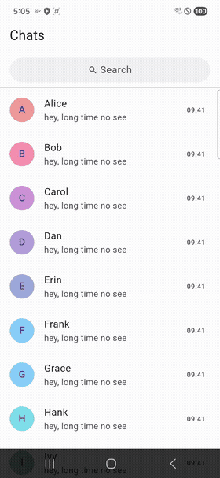

# sliver_snap_search_bar

A generic scroll-hide + magnetic-snap search bar Sliver for Flutter,
modeled after the Telegram iOS chat list.

The bar is **pinned** to the top of the scroll view but **compresses
smoothly** as the user scrolls up, then **snaps** to a clean 0 / 56 px
state when the user lifts their finger mid-compression — even when the
fling would otherwise leave it stuck at an awkward 30 px.

## Demo

<p align="center">
  
</p>

*(Recorded on a Samsung S24, running the app in `example/`. Full
[mp4](doc/demo.mp4) also in the repo.)*

## Why

Flutter's built-in `SliverAppBar` gives you a collapsing app bar, but
its snap behavior runs at the end of a fling, so the bar is often
visibly "waiting" before it snaps. Telegram iOS snaps the moment the
finger leaves the screen. This package reproduces that: an immediate,
pointer-up-driven snap with no dependency on the fling animation.

It also solves the **"re-entry race"** that plagues DIY
save-and-restore offsets: bumping a monotonic version on every enter
/ exit and aborting stale post-frame recursions.

## Features

- ✅ **Pinned-with-collapse** — a `SliverPersistentHeader(pinned: true)`
  whose `minExtent` flips between `0` (collapsible) and `maxExtent`
  (locked full-height during search) without tearing down the widget.
- ✅ **Dual-track fade** — the pill shell shrinks via height, the inner
  icon/text fades twice as fast so it disappears before the shell
  flattens.
- ✅ **Magnetic snap on finger lift** — 140 ms `easeOutCubic` to the
  nearer end, triggered from `Listener.onPointerUp`, no fling wait.
- ✅ **Safe offset restore** — monotonic version guard rejects stale
  recursion when the user re-enters search before restore completes.
- ✅ **Skinnable** — a default pill is provided, but any custom widget
  can plug into `SliverSnapScope.of(context).contentOpacity` and get
  the fade for free.
- ✅ **No dependencies** beyond Flutter itself.

## Getting started

Add to your `pubspec.yaml`:

```yaml
dependencies:
  sliver_snap_search_bar: ^0.1.0
```

## Minimal usage (batteries-included)

Use `SliverSnapView` when you want the behavior with zero
plumbing:

```dart
import 'package:flutter/material.dart';
import 'package:sliver_snap_search_bar/sliver_snap_search_bar.dart';

class ChatListPage extends StatefulWidget {
  const ChatListPage({super.key});
  @override
  State<ChatListPage> createState() => _ChatListPageState();
}

class _ChatListPageState extends State<ChatListPage> {
  final _textCtrl = TextEditingController();
  final _focus = FocusNode();
  bool _isSearching = false;

  @override
  void dispose() {
    _textCtrl.dispose();
    _focus.dispose();
    super.dispose();
  }

  @override
  Widget build(BuildContext context) {
    return Scaffold(
      appBar: AppBar(title: const Text('Chats')),
      body: SliverSnapView(
        isSearching: _isSearching,
        searchBar: DefaultSliverSnapRow(
          isSearching: _isSearching,
          controller: _textCtrl,
          focusNode: _focus,
          onTap: () => setState(() => _isSearching = true),
          onBack: () {
            _textCtrl.clear();
            _focus.unfocus();
            setState(() => _isSearching = false);
          },
        ),
        slivers: [
          SliverList.list(
            children: [
              for (int i = 0; i < 50; i++)
                ListTile(
                  leading: CircleAvatar(child: Text('$i')),
                  title: Text('Item #$i'),
                ),
            ],
          ),
        ],
        searchResultSliver: _isSearching
            ? SliverFillRemaining(
                child: Center(
                  child: Text('Searching "${_textCtrl.text}" …'),
                ),
              )
            : null,
      ),
    );
  }
}
```

## Advanced usage (compose primitives)

For any non-trivial integration (custom scroll physics, additional
slivers above the search bar, your own gesture listener, etc.) skip
`SliverSnapView` and compose the three primitives directly:

```dart
class _ChatListPageState extends State<ChatListPage> {
  final _scrollCtrl = ScrollController();
  late final _snapCtrl = SliverSnapController(scrollController: _scrollCtrl);
  final _textCtrl = TextEditingController();
  final _focus = FocusNode();
  bool _isSearching = false;

  void _enterSearch() {
    _snapCtrl.savePreSearchOffset();
    setState(() => _isSearching = true);
    // After the delegate switches to pinned (minExtent = totalHeight)
    // on the next frame, align the scroll to 0.
    WidgetsBinding.instance.addPostFrameCallback((_) {
      if (_scrollCtrl.hasClients && _scrollCtrl.offset != 0) {
        _scrollCtrl.jumpTo(0);
      }
    });
  }

  void _exitSearch() {
    _textCtrl.clear();
    _focus.unfocus();
    setState(() => _isSearching = false);
    _snapCtrl.restorePreSearchOffset();
  }

  @override
  Widget build(BuildContext context) {
    return Listener(
      onPointerUp: (_) => _snapCtrl.maybeSnapOnPointerUp(),
      onPointerCancel: (_) => _snapCtrl.maybeSnapOnPointerUp(),
      child: CustomScrollView(
        controller: _scrollCtrl,
        slivers: [
          // Your own app bar can go here.
          SliverPersistentHeader(
            pinned: true,
            delegate: SliverSnapSearchBarDelegate(
              isSearching: _isSearching,
              child: DefaultSliverSnapRow(
                isSearching: _isSearching,
                controller: _textCtrl,
                focusNode: _focus,
                onTap: _enterSearch,
                onBack: _exitSearch,
              ),
            ),
          ),
          // Optional 1-px divider below the bar (Telegram-style).
          const SliverToBoxAdapter(child: Divider(height: 1)),
          SliverList.list(children: _items),
        ],
      ),
    );
  }

  @override
  void dispose() {
    _snapCtrl.dispose();
    _scrollCtrl.dispose();
    _textCtrl.dispose();
    _focus.dispose();
    super.dispose();
  }
}
```

## Custom search row

Want your own design? Build any widget and read the current fade
opacity from `SliverSnapScope.of(context)`:

```dart
class BrandedSearchRow extends StatelessWidget {
  const BrandedSearchRow({super.key});

  @override
  Widget build(BuildContext context) {
    final scope = SliverSnapScope.of(context);
    return Opacity(
      opacity: scope.contentOpacity,
      child: Container(
        decoration: BoxDecoration(
          color: Colors.deepPurple.shade50,
          borderRadius: BorderRadius.circular(20),
        ),
        child: Row(children: const [
          Padding(
            padding: EdgeInsets.symmetric(horizontal: 12),
            child: Icon(Icons.search_rounded),
          ),
          Expanded(child: Text('Find anything…')),
        ]),
      ),
    );
  }
}
```

## API surface

| Symbol | Purpose |
|---|---|
| `SliverSnapSearchBarDelegate` | `SliverPersistentHeaderDelegate`, the render primitive. |
| `SliverSnapController` | Owns the pointer-up snap + offset save/restore. |
| `SliverSnapView` | Convenience `CustomScrollView` wrapping the delegate + controller. |
| `DefaultSliverSnapRow` | Default pill with icon + `TextField` + cancel. |
| `SliverSnapScope` | Inherited opacity/disabled state (for custom rows). |
| `kDefaultSearchBarTotalHeight`, `kDefaultSnapDuration`, `kDefaultEarlyReturnRatio`, … | Public tuning constants. |

## Behavior details

### Dual-track fade

```
ratio          = 1 - shrinkOffset / totalHeight      (outer height scale)
contentOpacity = 1 - clamp(progress * 2, 0, 1)       (inner fade)
```

The inner content reaches `0` opacity at `progress = 0.5`, leaving a
blank pill that keeps shrinking. At `progress = 1`, `ratio = 0` and
the pill is gone.

### Early return

Below `ratio < earlyReturnRatio` (default 0.1 = 10%), the delegate
returns `SizedBox(height: contentHeight * ratio)` instead of rendering
the child. This avoids `TextField` intrinsic-height layout overflow at
sub-pixel heights.

### `shouldRebuild`

Compares structural fields only (`isSearching`, `isDisabled`,
`totalHeight`, …). `child` and `builder` are **not** compared —
downstream rebuilds flow through standard element-level diffing. This
keeps the delegate stable when the caller rebuilds its own tree (e.g.
inside a `ValueListenableBuilder` firing every pointer move).

### Snap safety

* `maybeSnapOnPointerUp()` early-returns if a snap is already in
  progress (`_isSnapping`) — back-to-back pointer-up events cannot
  cascade jumps.
* `animateTo` errors that are `FlutterError` subclasses (`detached`,
  `disposed`, `no attached positions`) are silently swallowed as
  expected lifecycle noise; anything else re-throws.
* `savePreSearchOffset()` bumps the version and clears the snap
  flag atomically, so a pending snap cannot leak across a search mode
  transition.

### Offset restore retry

`restorePreSearchOffset()` schedules a post-frame callback that
checks `ScrollPosition.hasContentDimensions`. When the paired
delegate flips from "pinned full" back to "collapsible", the first
frame may not have measured content yet and a naive restore would
clamp to `(0, 0)` and swallow the offset. The controller retries up
to `kDefaultRestoreMaxAttempts` frames, then falls back to
`jumpTo(0)` (and calls `onRestoreExhausted` if provided) — no silent
failure.

## FAQ

**Q: Can I use this with `NestedScrollView` / `SliverAppBar`?**
A: Yes — the delegate is a regular `SliverPersistentHeaderDelegate`,
so it can sit inside any sliver chain. The snap gesture uses the
outer scroll controller you pass in.

**Q: What happens on an over-scroll (e.g. `BouncingScrollPhysics`
at top)?**
A: `maybeSnapOnPointerUp` short-circuits when `pixels <= 0`, so the
natural bounce-back physics owns the over-scroll region. Once the
bounce settles at `0`, nothing further happens.

**Q: Does it work in RTL?**
A: Yes. The delegate uses logical edges (`horizontal` symmetric
padding), and the default row honors `Directionality`.

**Q: Why 140 ms for the snap?**
A: Matches Telegram iOS observationally; above 200 ms feels
sluggish, below 100 ms feels jarring. Override with
`SliverSnapController(snapDuration: …)`.

## License

MIT. See [LICENSE](LICENSE).
